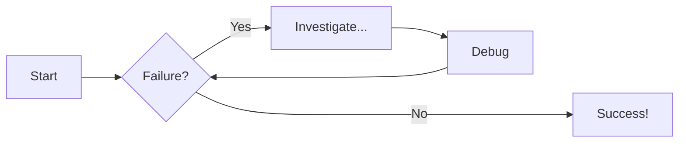

# Welcome to MkDocs

For full documentation visit [mkdocs.org](https://www.mkdocs.org).

## Commands

* `mkdocs new [dir-name]` - Create a new project.
* `mkdocs serve` - Start the live-reloading docs server.
* `mkdocs build` - Build the documentation site.
* `mkdocs -h` - Print help message and exit.

## Project layout

    mkdocs.yml    # The configuration file.
    docs/
        index.md  # The documentation homepage.
        ...       # Other markdown pages, images and other files.

i like :beers:

```lua title="add exp" linenums="1" hl_lines="3-4"
local module = require(game:GetService("ReplicatedStorage").Locksy)

module.AddEXP(pla, 2)
module.AddEXP(pla, 4)
module.AddEXP(pla, 5)
module.AddEXP(pla, 7)
```

!!! note "Your Gay!"

    did you know that ur super freaking gay?

??? info "psst"

    Your still super freaking gay

# Diagram Examples

## Flowcharts

